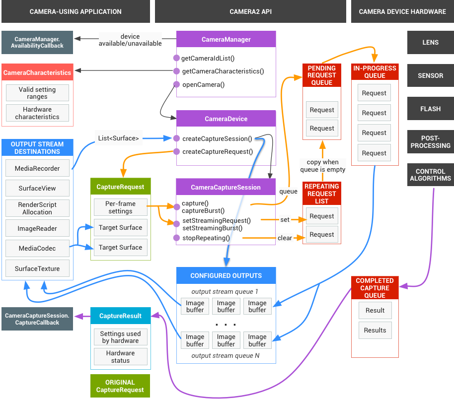
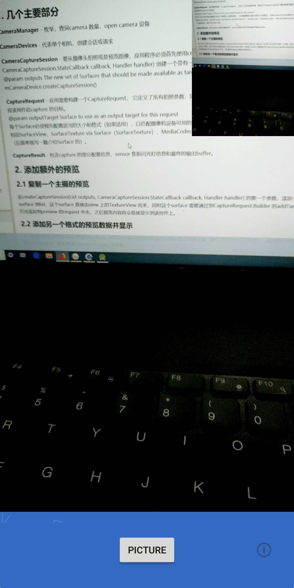
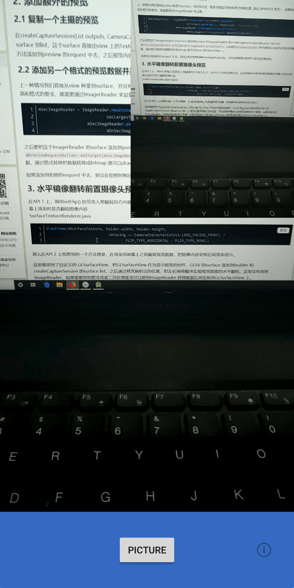
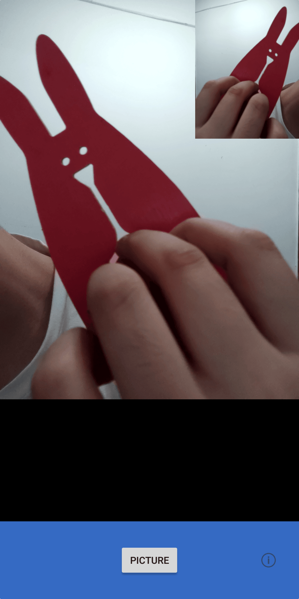

# Camera API 2 学习记录

本文是学习camera API 2 过程一些的记录。文档大部分来自官网，代码基本上来自Google [Camera2Basic](https://github.com/googlesamples/android-Camera2Basic)。



# 1. 几个主要部分

**CameraManager** - 枚举，查询camera 数量，open camera 设备

**CameraDevices** - 代表单个相机，创建会话或请求

**CameraCaptureSession** - 要从摄像头拍照或是预览图像，应用程序必须首先使用createCaptureSession(List<Surface> outputs, CameraCaptureSession.StateCallback callback, Handler handler) 创建一个带有一组输出Surface 的camera capture session。
@param outputs The new set of Surfaces that should be made available as targets for captured image data.
mCameraDevice.createCaptureSession()

**CaptureRequest** - 应用需要构建一个CaptureRequest， 它定义了所有拍照参数，同时这个Request 还列出了哪些配置的输出Surface 应该用作此capture 的目标。
@param outputTarget Surface to use as an output target for this request
每个Surface必须预先配置适当的大小和格式（如果适用），以匹配摄像机设备可用的大小和格式。 目标Surface可以从各种类中获得，包括SurfaceView，SurfaceTexture via Surface（SurfaceTexture），MediaCodec，MediaRecorder，Allocation和ImageReader。
（后面单独写一篇介绍Surface 的）。

**CaptureResult** - 包含capture 的部分配置信息，sensor 焦距闪光灯信息和最终的输出buffer。

# 2. 添加额外的预览

## 2.1 复制一个主摄的预览

在createCaptureSession(List<Surface> outputs, CameraCaptureSession.StateCallback callback, Handler handler) 的第一个参数，添加一个surface 到list，这个surface 直接由view 上的TextureView 而来，同时这个surface 需要通过到CaptureRequest.Builder 的addTarget 方法添加到preview 的request 中去，之后预览内容将会直接显示到该控件上。


参考代码： https://github.com/hcz017/android-Camera2Basic/tree/add_another_main_preview

## 2.2 添加另一个格式的预览数据并显示

上一种情况我们直接从view 种拿到surface，并没有对这一路预览数据的格式做设置（默认为PRIVATE 格式），如果我们有格式的要求，就需要通过ImagerReader 来设置。

```java
mSecImageReader = ImageReader.newInstance(secLargest.getWidth(),
                            secLargest.getHeight(), imageFormat, /*maxImages*/2);
                    mSecImageReader.setOnImageAvailableListener(
                            mOnSecImageAvailableListener, mBackgroundHandler);
```

之后要把这个ImagerReader 的surface 添加到preview 的request.builder 和createCaptureSession 的surface list 中去 `mPreviewRequestBuilder.addTarget(mSecImageReader.getSurface());` 之后通过`onImageAvailable` 的回调就可以取得实时预览的数据，通过格式转换把数据转换成bitmap 就可以draw 到TextureView 上(从性能上考虑这不是最优方案)。



如果添加到拍照的request 中去，则会在拍照时候回调onImageAvailable，同时拍两种格式的照片就是这样做到的。
参考代码： https://github.com/hcz017/android-Camera2Basic/tree/sec_format_preview

# 3. 水平镜像翻转前置摄像头预览

在API 1 上，调用setFlip() 防范传入想翻转的方向就可以了，在API 上没有对应的方法，在系统源码中系统会根据摄像头的朝向决定在屏幕上渲染时是否翻转图像内容
SurfaceTextureRenderer.java

```java
drawFrame(mSurfaceTexture, holder.width, holder.height,
                            (mFacing == CameraCharacteristics.LENS_FACING_FRONT) ?
                                    FLIP_TYPE_HORIZONTAL : FLIP_TYPE_NONE);
```

那么在API 2 上我想到的一个方法便是，在渲染到屏幕上之前截取预览数据，把图像内容变换后再渲染显示。

这里就用到了自定义的 GLSurfaceView，把GLSurfaceView 作为显示预览的控件，GLSV 的surface 添加到builder 和createCaptureSession 的surface list，之后通过修改映射点的位置，把左右调换顺序实现预览图象的水平翻转。这里没有用到ImageReader，如果需要其他格式或者二次处理需求可以使用ImageReader 获得数据后再绘制到GLSurfaceView 上。


参考代码： https://github.com/hcz017/android-Camera2Basic/tree/mirror_flip_front_camera_preview

# 4. 问题

在onImageAvailable 回调中，用完image 后及时close image。另外如果时多线程的话，注意view destory 和停止渲染预览的先后关系。有可能会出现view 已经销毁了但是还在试图渲染新的图像，此时会报错。

## 参考链接

[android.hardware.camera2](https://developer.android.com/reference/android/hardware/camera2/package-summary)

[CameraCaptureSession](https://developer.android.com/reference/android/hardware/camera2/CameraCaptureSession)

[CameraDevice](https://developer.android.com/reference/android/hardware/camera2/CameraDevice)